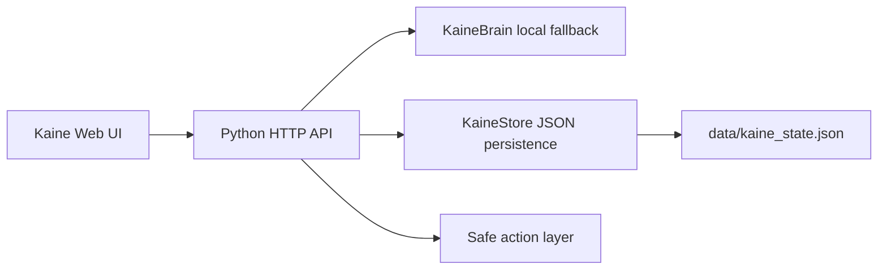

# Kaine Architecture

## Product Direction

Kaine is a local-first AI operator: a desktop-grade command center that can reason, remember, plan, monitor, and eventually execute approved workflows across a user's projects. It should feel like a real system, not a chatbot in a box.

The first version prioritizes four qualities:

- Presence: Kaine has a visible identity, live state, and speech-synced animation.
- Utility: Kaine can answer, plan, capture memory, and inspect its own project state without external services.
- Safety: Tool execution starts with safe, read-only actions. Destructive or external actions are out of scope until policy gates exist.
- Extensibility: The server and UI are small enough to understand, but separated enough to grow into providers, plugins, and desktop packaging.

## Runtime Shape

## Native UE5 Rebuild

`KaineUE5/` is the native Unreal Engine 5.7 rebuild path for a more photorealistic 3D assistant presence.

The current slice is C++ first and uses the stock OpenWorld map as a launch host. `AKaineGameMode` spawns the runtime scene actor, sets the cinematic camera pawn, and enables the HUD. `AKaineCommandLab` procedurally builds the 3D command room at startup so the scene is immediately visible without needing hand-authored assets.

Rendering and presentation priorities:

- Lumen-style dynamic GI and reflections through project renderer settings.
- Virtual shadow maps, bloom, ambient occlusion, lens effects, fog, and post processing.
- Dark metal and glass material intent with teal/amber assistant lighting.
- Animated 3D Kaine identity core with a procedural faceted shell, face plates, eye bars, speech bars, rotating rings, pulsing lights, and command-room workstations.
- Premium in-world UI graphics carry the primary interface so the scene reads as a physical command center instead of a flat overlay: tabbed command rails, framed panes, a radial scanner, memory-node graph, status cards, floor data traces, and animated telemetry.
- `ProceduralMeshComponent` is enabled for custom beveled panels, segmented glass halo pieces, and rear server-rack assets instead of relying only on scaled cube primitives.
- HUD telemetry stays restrained and supports the scene with cinematic frame lines, status tabs, run-state cards, and speech activity without covering the 3D composition.

Verification markers:

- `LogLoad: Game class is 'KaineGameMode'`
- `LogKaineUE5: Display: Kaine polished UI scene spawned: ring_segments=128 panel_lights=6 hologram_panels=3 data_bars=67 authored_panels=42 premium_ui=133`
- `LogKaineUE5: Display: Kaine UE5 photoreal command lab active: scene=1 pawn=1 hud=1 renderer=Lumen/VSM`
- `UEngine::LoadMap Load map complete /Engine/Maps/Templates/OpenWorld`

## Components

### Web UI

Located in `web/`.

- `index.html`: App shell and accessibility structure.
- `styles.css`: Visual system, responsive layout, animated identity core.
- `app.js`: State management, chat transport, voice hooks, canvas field, and DOM updates.

The UI is built as the first screen, not a landing page. It exposes the core workflows directly: chat, mode selection, mission queue, memory, diagnostics, and voice state.

### Server

Located in `kaine_server.py`.

- Serves static frontend files.
- Exposes JSON APIs under `/api`.
- Persists memories, missions, and conversation history.
- Provides a deterministic local fallback brain so first launch works without credentials.

### Persistence

Stored at `data/kaine_state.json` by default. This path is ignored by Git because it may contain local notes and conversation history.

### Safe Actions

The first slice supports read-only introspection:

- Server uptime and environment status.
- Workspace file summary.
- Mission creation from user prompts.
- Memory capture from explicit user intent.

Arbitrary shell commands are intentionally not exposed in the UI or API yet.

## API Surface

- `GET /api/status`: Runtime status, uptime, version, and safe environment summary.
- `GET /api/state`: Current conversation tail, memories, missions, and status.
- `POST /api/chat`: Send a message and receive Kaine's response.
- `POST /api/memory`: Save an explicit memory.
- `POST /api/mission`: Create a mission manually.

## Assistant Modes

- Operator: Direct triage and next action.
- Engineer: Implementation planning, risk, verification.
- Security: Threat model, policy, guardrails.
- Strategy: Architecture, roadmap, leverage points.
- Creative: Naming, UX polish, presentation.

## Growth Path

1. Add provider adapters for local models and cloud LLMs behind a single interface.
2. Add a permissioned tool registry with allowlists, dry runs, and audit logs.
3. Package as a desktop app after the web/server slice stabilizes.
4. Add project indexing and semantic memory.
5. Add phone companion over authenticated LAN APIs.
6. Add proactive monitors through scheduled jobs and notification channels.
